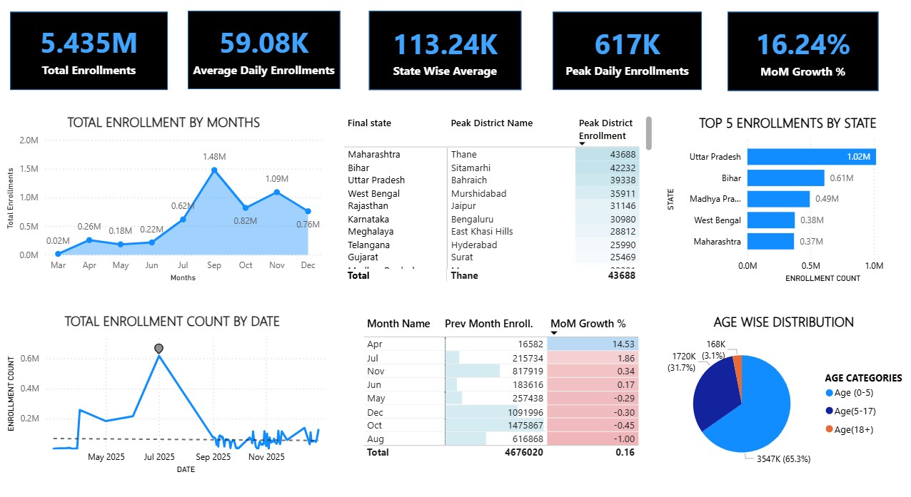

# UIDAI Enrollment Analytics Dashboard

This project was developed for the UIDAI Hackathon to analyze Aadhaar enrollment data using Power BI.

## Tools Used
- Power BI
- DAX
- Data Visualization

## Key Metrics
- Total Enrollments: 5.43M
- Average Daily Enrollments: 59K
- Peak Daily Enrollments: 617K
- Month-on-Month Growth: 16.24%

## Insights
- Identified peak enrollment periods across months
- Analyzed state-wise enrollment distribution
- Studied age-wise demographic trends

## Dashboard Preview

## Project Files
- `.pbip` Power BI project
- Dashboard screenshots
- Hackathon report